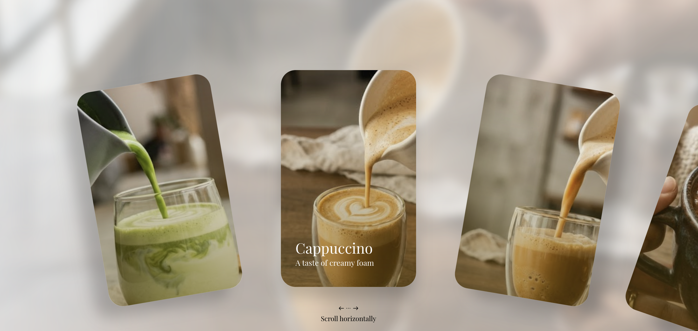

# full-css-animated-carousel

A full CSS carousel with nice animations — no JS needed for the carousel itself.



## Getting started

```bash
npm install
npm run dev
```

Then open the URL Vite prints.

## Scripts

- `npm run dev` — start the dev server
- `npm run build` — build to `dist/`
- `npm run preview` — preview the build

The animation runs entirely in CSS (scroll-driven animations). The only JavaScript is a small [Tweakpane](https://tweakpane.github.io/docs/) panel to tweak the easing, snapping and a debug view.

## Links

- [Article](https://codocular.com/2026/09/09/lets-explore-css-scroll-driven-animations-with-a-full-css-carousel-again/)
- [GitHub](https://github.com/TimGuignard/full-css-animated-carousel)
- [CodePen](https://codepen.io/editor/TimGuignard/pen/01a086ce-5449-714a-b61b-1b1037786922)
